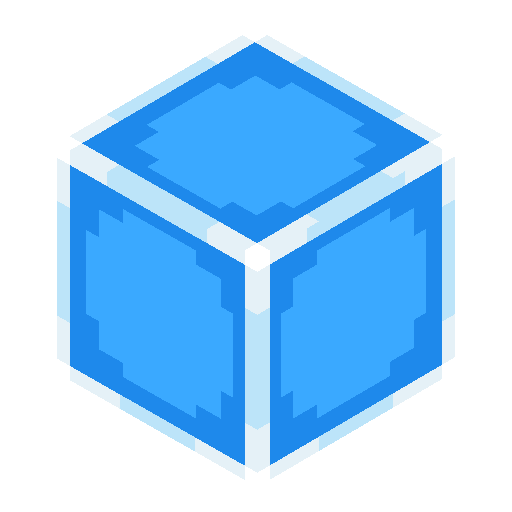
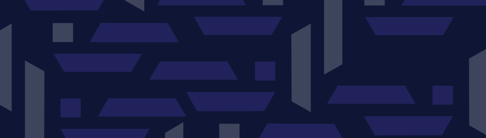

  

# 
Cubepanion API

Created as backend to make [Cubepanion](https://github.com/Fesaa/Cubepanion) more dynamically updatable; but publicly available for useless information about CubeCraft Java. 

# Usage

The API is freely available on `https://ameliah.art/cubepanion/`, with a high rate limit. You'll have to figure out the paths yourself from the Addon source code,
they're behind a nginx proxy so it's slightly different from the paths in the go code. 

# Contribution & Bugs
Always welcome to open an issue or fix the bug yourself and opening a pull request. For features, please first open a ticket or contact me on discord (ameliahh)

  

